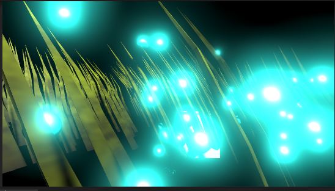

# Messenging_ECS

## Description

Messenging_ECS is a humble library for using a message, or event based system with Unities Entity Component System.
It is recommended to have all non-deterministic actions be initiated through a message. Doing so will provide insight into what actions and changes occur during the lifecycle of your game or project, using the message logging system.
Moreover, it will be possible to record and replay the last game session.
If non-deterministic actions occur without passing through the message system, the replay may show a different result than the actually played session.

## Dependencies

### 2019 July 4th

This library currently uses the following package versions:

- Entities: preview.30 - 0.0.12
- Hybrid Renderer: preview.10 - 0.0.1
- Lightweight RP: 5.7.2

The Entities package is required to run the library.
The demo depends on the Hybrid Renderer and the Lightweight RP.

## Demo

A simple demo is included to illustrate how the messenging system can be used.

### Playing the demo

The cube can be moved around using the wasd keys.
The cube can emit blue shiny spheres in multiple directions by pressing the enter key.
The cube can grow grass around it by pressing the spacebar.

The number of spheres and grass halms spawned per frame can be set by clicking the cube and modifying the Spawn Count on the ProjectilePrototypeProxy, and the PlantPrototypeProxy respectively.

### Logging

By default all handled messages will be serialized and output to the console.
By clicking the Settings object, log settings can be adjusted in the inspector window.
Logging can be enabled or disabled by modifying the Logging Enabled checkbox.
It is possible to filter what messages should be output to the console by adding patterns to the Log Filter array.

### Replay

By default all messages handled will be saved so that the last session played can be replayed.
To replay the last session, select the Settings object, and check the Replay Enabled checkbox.
When hitting the play button, the recording of the last played session will be shown.

## Usage and concepts

### Usage

- Copy the contents of the Assets/Scripts/Messenging into your projects Plugins folder.
- Create an empty game object in your scene, and name it "Settings" or something similar.
- Add a "SettingsProxy" and a "ConvertToEntity" component.
- Define and use your custom messages.

### Message

A message can be send out with a Sender address, a Receiver address and a custom defined Payload. To see a sample of how to consume messages, see the "Demo/MoveSystem.cs" contents.

### Address

An address can be attached to entities to enable sending and receiving messages. The address id should be unique.

### Sender

The sender of a message. The sender id should correspond to the address id of the entity responsible for sending the message.

### Receiver

The receiver of a message. The receiver id corresponds to the address id of the entity that will consume the message.

### Payload

The data that represents the content of the message. For every defined message, a custom Payload should be defined as well.

### PayloadConverter

Some ECS specific types cannot be properly serialized, and a converter that will run before serialization needs to be defined.
See the MovePayloadConverter in the "Demo/MoveMessage.cs" file for an example.
